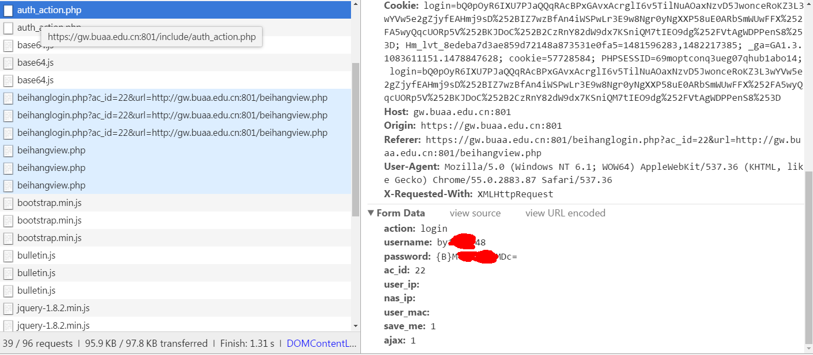

# 北航实验室断线重连
 
 北航实验室上网每天早上四点都会所有电脑下线，再上线需要手工登录。这个脚本是为了自动进行网上注册，解决每天手工登录问题。
  
 北航上网需要在gw.buaa.edu.cn上进行账号密码注册。 
 用chrome的network工具分析。在提交的时候有一条https://gw.buaa.edu.cn:801/include/auth_action.php 正含有注册用的username 和password的信息。
  
 
 这里username是学号,password 是Base64算法加密传输的。至于cookie, who cares.
 
  
 然后就用python模拟这次提交。写在(https://github.com/sienaiwun/Beihang-auto-net-login-python-script/tree/master/buaaNet/buaaNet/buaaNet.py) 里面。这里是用百度的连接来测试网络是否通畅。在main 函数里面每若干分钟执行一次提交。
 
最后把(https://github.com/sienaiwun/Beihang-auto-net-login-python-script/tree/master/buaaNet/buaaNet/buaaNet.bat) 放到 windows的启动命令里面，就可以随时登录了。
